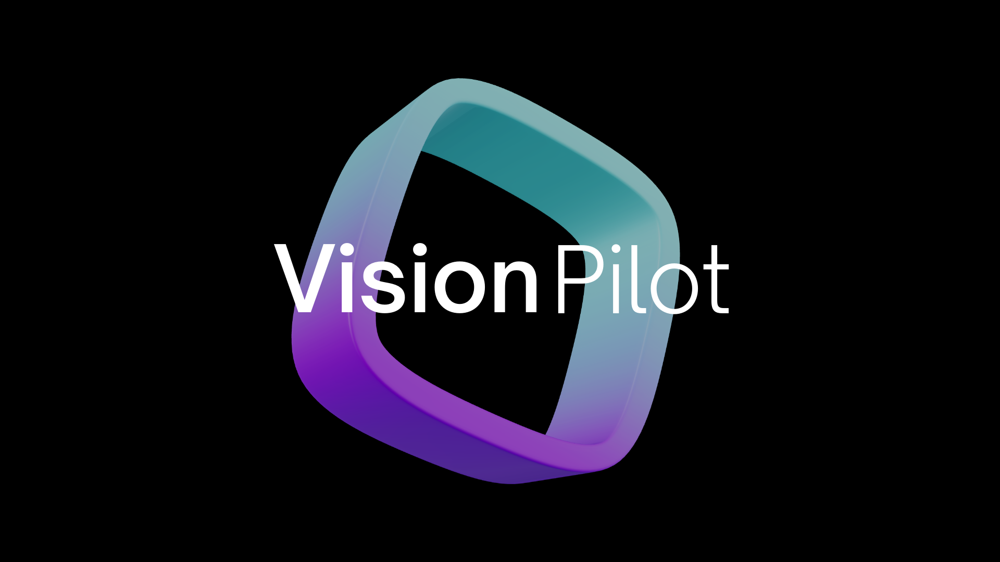

# Autoware - Open Source Autonomous Highway Pilot

    <picture>
        <source media="(prefers-color-scheme: dark)">
        
    </picture>

⭐ Star us on GitHub — your support motivates us a lot!

## Open-source highway autonomy system
This codebase contains **productionizable and safety certifiable code for an open-source highway autonomy** system that can power safe, SAE Level-4+, autonomous driving around the world. It is designed to be integrated with automotive OEMs and Tier-1 suppliers in series production privately owned passenger vehicles.

To learn more about how to participate in this project, please read the [onboarding guide](/ONBOARDING.md)

## End-to-End AI Architecture
We utilize an **End-to-End AI Architecture** in which each component technology of the highway pilot system is powered through neural-networks. Over the evolution of the project, we are introducing component-based/modular End-to-End AI, full monolithic End-to-End AI, as well as a new Hybrid End-to-End AI framework for optimal system explainability, introspection, verification and safety validation.

## No Reliance on High Definition Maps
**We do not require 3D high definition  maps**. Our stack can operate in a 'mapless' mode or use existing 2D navigational (sat-nav style) maps, also called ADAS maps. Human beings can drive without prior knowledge of the detailed 3D geometry of roadways by relying on real-time scene perception, and our system mimics this process.

## Technology Roadmap
We are developing true hands-off, eyes-off autonomous driving which is enabled on highways across the world where no human supervision is required of the vehicle. Rather than going for a single moonshot, we are sequentially building the core software stack of the highway pilot system in a modular manner, and releasing versions of the autonomous highway pilot system that serve a core customer need, where each new release expands upon the operational-design-domain, technology prowess and safety envelope of the prior release.

As part of our technology roadmap, we will sequentially develop three versions of the Autoware Autonomous Highway Pilot System, called:
- ***[Vision Pilot - Level 2+ highway autopilot through component-based End-to-End AI](/VisionPilot/)***
- ***Vision Pilot PRO - Level 2+ highway and urban autopilot through monolithic End-to-End AI***
- ***Vision Drive - Level 4+ all road autonomy using hybrid End-to-End AI***

## Models
All of our AI models are available under Apache 2.0 licence and can freely be used for commercial and research purposes. We release model architecture, data parsing scripts, training pipelines and model weights and fully open-source to help democratize access to this vital technology.

## Modules
Specific code modules for features such as Software-Defined vehicle implementaiton, Simulation, Control etc. can be found in the Modules folder.