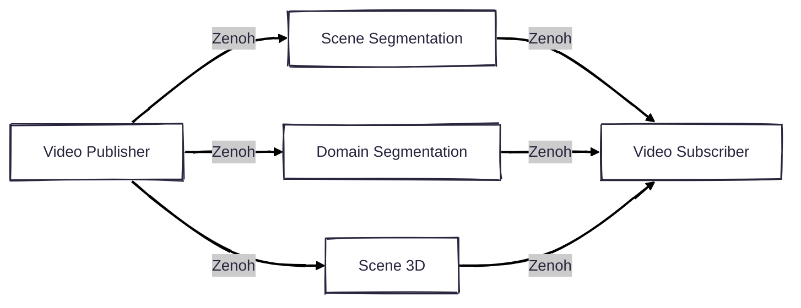

# VisionPilot Zenoh - Middleware Wrapper Layer

Zenoh is a performant protocol that can be used as a middleware of the AI pipeline.



## System Requirements

- Ubuntu 22.04

## Dependencies

- **OpenCV**: For image and video processing.
  - Ubuntu: `sudo apt install libopencv-dev`
- **Zenoh C library**: Required for the transportation.
  - Download from [the GitHub release](https://github.com/eclipse-zenoh/zenoh-c/releases)
  - You can also add the Eclipse repository for apt server.
  
    ```shell
    curl -L https://download.eclipse.org/zenoh/debian-repo/zenoh-public-key | sudo gpg --dearmor --yes --output /etc/apt/keyrings/zenoh-public-key.gpg
    echo "deb [signed-by=/etc/apt/keyrings/zenoh-public-key.gpg] https://download.eclipse.org/zenoh/debian-repo/ /" | sudo tee /etc/apt/sources.list.d/zenoh.list > /dev/null
    sudo apt update
    sudo apt install libzenohc-dev
    ```
- **Cmake**: For building the project.
  - Ubuntu: `sudo apt install cmake`
- **CLI11**: Used for the command line interface.
  - Ubuntu: `sudo apt install libcli11-dev`
- **CUDA**: Optional for GPU processing.
- **OpenCV**: For image and video processing.
  - Ubuntu: `sudo apt install libopencv-dev`
- **ONNX Runtime**: For model inference.
  - Download from [the GitHub release](https://github.com/microsoft/onnxruntime/releases)
- **LibTorch**: For tensor manipulation capabilities.
  - Download from [the PyTorch website](https://pytorch.org/get-started/locally/)
- **TensorRT**: Improve the inference performance.
  - Download from [the website](https://developer.nvidia.com/tensorrt)
  - Follow [the tutorial](https://docs.nvidia.com/deeplearning/tensorrt/latest/installing-tensorrt/installing.html) to install.
- **just**: Simplify the command.

  ```bash
  # If you are using Ubuntu 22.04
  wget -qO - 'https://proget.makedeb.org/debian-feeds/prebuilt-mpr.pub' | gpg --dearmor | sudo tee /usr/share/keyrings/prebuilt-mpr-archive-keyring.gpg 1> /dev/null
  echo "deb [arch=all,$(dpkg --print-architecture) signed-by=/usr/share/keyrings/prebuilt-mpr-archive-keyring.gpg] https://proget.makedeb.org prebuilt-mpr $(lsb_release -cs)" | sudo tee /etc/apt/sources.list.d/prebuilt-mpr.list
  sudo apt update
  # If not, just install it directly
  sudo apt install just
  ```

- **parallel**: Run commands in parallel

  ```bash
  sudo apt install parallel
  ```

## Environment note

This project relies on the system-installed `libzenohc`.
If ROS 2 Humble is sourced and `ros-humble-rmw-zenoh-cpp` is installed, the ROS-provided `libzenohc.so` will be used instead, which is ABI-incompatible and may cause crashes.

Build and run the examples in a shell where ROS 2 is not sourced.

Verify the loaded library with:
```bash
$ ldd ./install/bin/video_publisher | grep -i zenoh
# libzenohc.so => /lib/libzenohc.so
```

## Usage

- Build

```bash
# Build all
export LIBTORCH_INSTALL_ROOT=/path/to/libtorch/
export ONNXRUNTIME_ROOTDIR=/path/to/onnxruntime-linux-x64-gpu-1.22.0
just all
# Optional (Build the project respectively)
just video_pubsub
just models
```

- Run pipelines

```bash
# Original video pub/sub
just run_video_pubsub
# SceneSeg
just run_sceneseg
# DomainSeg
just run_domainseg
# Scene3D
just run_scene3d
# AutoSpeed
just run_autospeed
```

- Clean the project

```bash
just clean
```

## AutoSpeed

AutoSpeed detects vehicles and estimates distance/velocity using homography-based projection.

### Homography Calibration

AutoSpeed requires a homography file to convert image coordinates to world distances.

- A homography file for testing is provided in `test` (from `Standalone/AutoSpeed`).
- For custom cameras, modify the values or use `../Calibration/compute_homography.py` to generate a new one.
