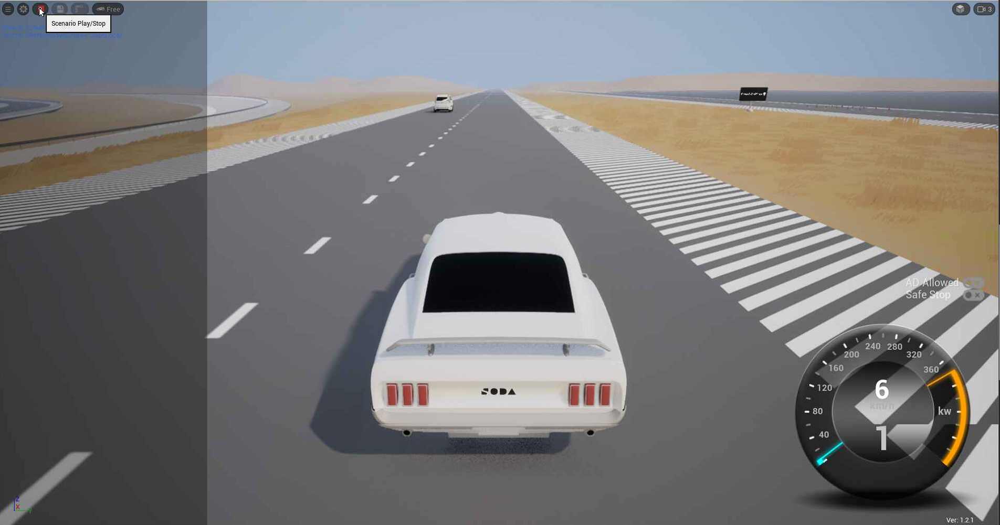
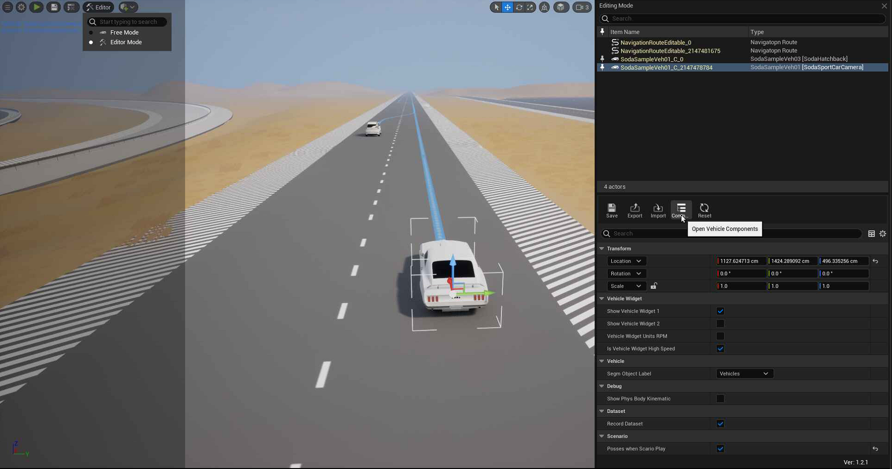
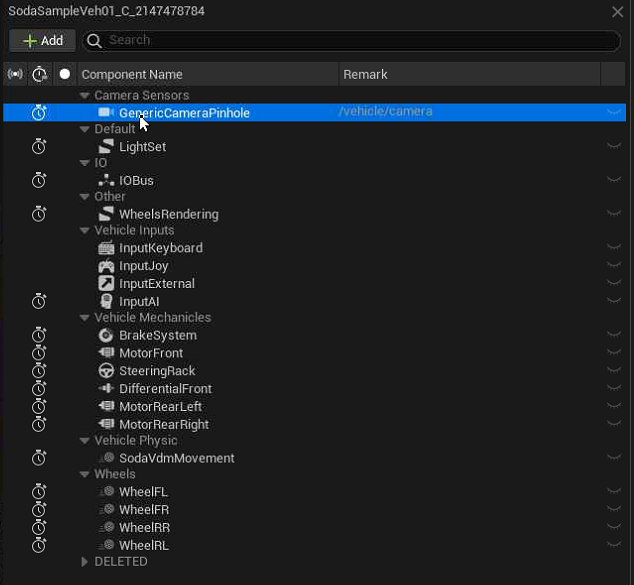
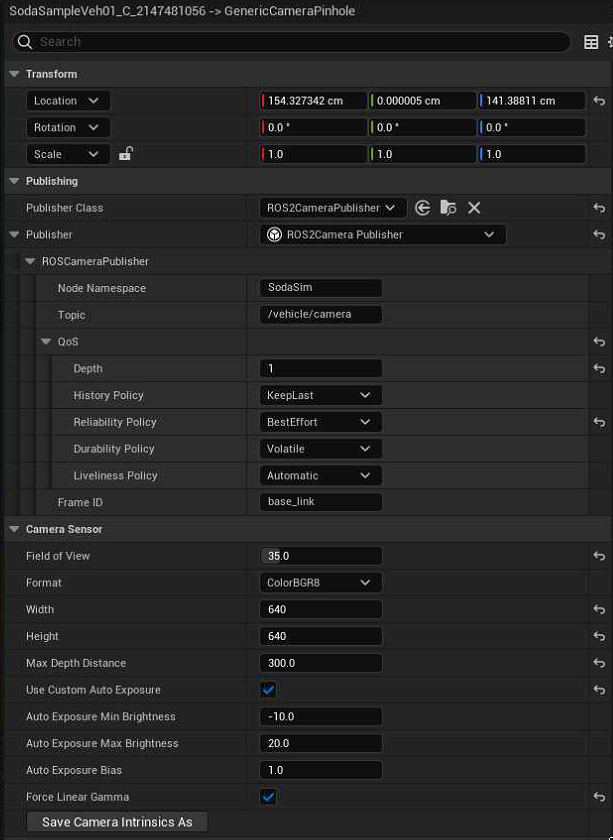

## SodaSim ↔ Autoware Integration Notes

Soda.Sim is an Unreal Engine–based simulator that can publish vehicle and sensor data over ROS 2.

This document describes the minimal steps to run SodaSim **v1.2.1** with an example scenario and validate a basic Autoware integration using the camera topic `/vehicle/camera` (SceneSeg pipeline). It also includes where to find camera topic/QoS/image settings inside the SodaSim UI.

### Steps

1. **SodaSim binaries (free release)**
   - Download and extract the SodaSim **v1.2.1** free binary release from `https://github.com/soda-auto/soda-sim/releases`.
   - Linux entry point: `SodaSimProject.sh` inside the extracted release directory.
   - Windows entry point: `SodaSimProject.exe` in the extracted release directory root.

2. **Install Autoware example scenario files (SaveGame + vehicles)**
   - These files are the same for Linux and Windows.
   - Copy these files from this repo into your extracted SodaSim directory:
     - SaveGame → `SodaSimProject/Saved/SaveGames/LevelState_VirtualProvingGround_1.sav`
     - Vehicles → `SodaSimProject/Saved/SodaVehicles/SodaSportCarCamera.json` and `SodaSimProject/Saved/SodaVehicles/SodaHatchback.json`
   - Source files in this repo:
     - `scenario/SaveGames/LevelState_VirtualProvingGround_1.sav`
     - `scenario/SodaVehicles/SodaSportCarCamera.json`
     - `scenario/SodaVehicles/SodaHatchback.json`

3. **Run SodaSim**
   - Linux: run `SodaSimProject.sh` from the extracted release directory.
   - Windows: run `SodaSimProject.exe` from the extracted release directory.

4. **Run scenario**
   - Click the `Scenario Play/Stop` button in the top-left toolbar.
   - 

5. **Autoware-side bringup**
   - The simplest “proof” pipeline is to run SceneSeg using the Soda.Sim ROS 2 camera topic as input.

#### SceneSeg (AutoSeg) with Soda.Sim ROS 2 camera topic

This section assumes you have the `autoware.privately-owned-vehicles` repository checked out and have built the VisionPilot ROS2 workspace by following `VisionPilot/Middleware_Recipes/ROS2/README.md` in that repo.

##### Soda.Sim ROS 2 camera topic

Default topic name: `/vehicle/camera` (examples below use this; replace if your setup differs).

- Topic: `/vehicle/camera`
- Message type: `sensor_msgs/msg/Image`
- Encoding: `bgr8` / `ColorBGR8` (as configured in SodaSim camera settings)
- QoS (typical): `BestEffort`, `KeepLast`, `depth=1`, `durability=Volatile`

##### Confirm the camera topic is publishing

- List topics:
  - `ros2 topic list | rg "/vehicle/camera"`
- Check type:
  - `ros2 topic info /vehicle/camera`
- Check QoS offered (and see active publishers/subscribers):
  - `ros2 topic info -v /vehicle/camera`
- Confirm messages are flowing:
  - `ros2 topic hz /vehicle/camera`

##### Multi-machine note

SodaSim and Autoware can run on different machines as long as they are on the same network and use compatible ROS 2 DDS settings (e.g., matching `ROS_DOMAIN_ID`, and DDS discovery not blocked by firewalls/NAT).

1. Start SodaSim, load the scenario, and confirm the camera is publishing:
   - `ros2 topic list | rg "/vehicle/camera"`

2. Build and source the VisionPilot ROS2 workspace (see `VisionPilot/Middleware_Recipes/ROS2/README.md`).
   - In general you will:
     - `cd <AUTOWARE_POV_ROOT>/VisionPilot/Middleware_Recipes/ROS2`
     - `colcon build --symlink-install --packages-select models visualization`
     - `source install/setup.bash`

3. Download the required ONNX model file(s) separately.
   - The repo does not necessarily include the ONNX weights; obtain the SceneSeg ONNX model (and any other required weights) separately and note the local path.

4. Create a small parameter file for the SceneSeg node (avoid relying on default configs that assume `/sensors/video/image_raw`).
   - Create `sodasim_autoseg.yaml` anywhere you like with:

```yaml
scene_seg_model:
  ros__parameters:
    # Set this to the path where you placed the SceneSeg ONNX file.
    model_path: "/absolute/path/to/SceneSeg_FP32.onnx"
    backend: "onnxruntime"   # or "tensorrt" if your build supports it
    precision: "cpu"         # "cpu" is most portable; use "cuda"/"fp16" if supported
    model_type: "segmentation"
    input_topic: "/vehicle/camera"
    output_topic: "/autoseg/scene_seg/mask"
    gpu_backend: "cuda"
```

5. Run SceneSeg:
   - `cd <AUTOWARE_POV_ROOT>/VisionPilot/Middleware_Recipes/ROS2`
   - `ros2 launch models auto_seg.launch.py model_name:=scene_seg_model param_file:=/path/to/sodasim_autoseg.yaml`

6. Visualize the mask overlay:
   - `cd <AUTOWARE_POV_ROOT>/VisionPilot/Middleware_Recipes/ROS2`
   - `ros2 launch visualization visualize_scene_seg.launch.py image_topic:=/vehicle/camera mask_topic:=/autoseg/scene_seg/mask output_topic:=/autoseg/scene_seg/viz`
   - View `/autoseg/scene_seg/viz` using your preferred viewer (e.g. `rqt_image_view`).

Expected result: 

### Camera publisher parameters (UI)

To view and edit camera ROS 2 settings (topic/QoS/frame) and image settings (FOV, resolution, format), use the Vehicle Components panel:

1. Select the ego vehicle actor in the World Outliner (right-side panel).
   - 
2. Click `Open Vehicle Components`.
3. In the components tree, expand `Camera Sensors` and select the camera (example: `GenericCameraPinhole`).
   - 
4. Edit parameters in the details panel under:
   - `Publishing` → `Publisher` (ROS 2-related)
   - `Camera Sensor` (image-related)
   - 

#### ROS 2-related fields (Publisher)

Example values shown in the UI:

- `Publisher Class`: `ROS2CameraPublisher`
- `Node Namespace`: `SodaSim`
- `Topic`: `/vehicle/camera` (default)
- `QoS`:
  - `Depth`: `1`
  - `History Policy`: `KeepLast`
  - `Reliability Policy`: `BestEffort`
  - `Durability Policy`: `Volatile`
  - `Liveliness Policy`: `Automatic`
- `Frame ID`: `base_link`

#### Image-related fields (Camera Sensor)

Example values shown in the UI:

- `Field of View`: `35.0`
- `Format`: `ColorBGR8`
- `Width`: `640`
- `Height`: `640`
- `Max Depth Distance`: `300.0`
- `Force Linear Gamma`: (toggle)
- Auto exposure (if enabled):
  - `Auto Exposure Min Brightness`: `-10.0`
  - `Auto Exposure Max Brightness`: `20.0`
- `Auto Exposure Bias`: `1.0`

### ROS 2 GStreamer bridge (standalone)

This repo includes a standalone ROS 2 package that rebroadcasts Soda.Sim ROS 2 camera topic into a GStreamer pipeline without any Autoware dependencies.

See `ros2_gstreamer/README.md` for dependencies, build, and run instructions.

### Contact

- Email: `sim@soda.auto`
- Repo: `https://github.com/soda-auto/soda-sim`
- For questions or collaboration inquiries, reach out via email.
